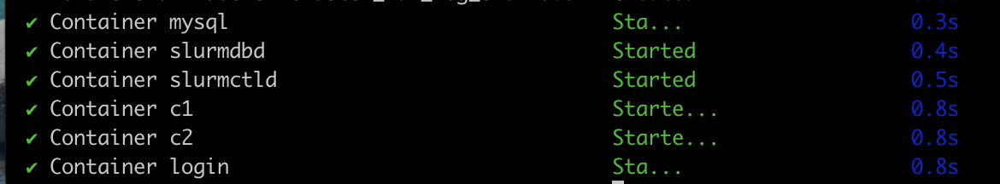

# Installation

This document provides guidance on setting up an environment for the HPC course exercises. Let’s start by preparing the necessary information first..


# Jump To:
- [Pre-requisites](#pre-requisites)
- [Creating Docker-based Slurm Cluster](#creating-docker-based-slurm-cluster)
- [Building and installing QRMI and SPANK Plugins](#building-and-installing-qrmi-and-spank-plugins)
- [Modify configurations for this course](#configure-slurmconf-and-qrmi_configjson)
- [Copy course files and install Course Requirements](#copy-and-install-requirements)

# Pre-requisites

## Docker Environment
The exercises will be conducted using Docker, which includes a Slurm cluster set up on your local computer.

Docker is an open platform for packaging, distributing, and running applications in lightweight, portable containers. It streamlines development workflows by isolating applications with their dependencies, ensuring consistent behavior across environments—from local laptops to cloud servers.

At its core, Docker Engine manages containers using OS-level virtualization on Linux and lightweight VMs on macOS and Windows.
To use Docker on your desktop, you need to install one of the following:

- [Docker Desktop](https://docs.docker.com/get-docker/) or [Rancher Desktop](https://rancherdesktop.io/) 
- Alternatively, [Podman](https://podman.io/getting-started/installation.html)

## IBM Cloud Credentials for QPU access

You will need valid IBM Cloud credentials to access the Quantum Processing Unit (QPU). Make sure your account is set up and ready before starting the exercises.

Please refer to the [Set up your IBM Cloud account](https://quantum.cloud.ibm.com/docs/en/guides/cloud-setup) guide to create and configure your account.
After completing the setup, save your access credentials by following the instructions in [Save your login credentials](https://quantum.cloud.ibm.com/docs/en/guides/save-credentials) at a text note. You will need an `API key` and `CRNs(Compute Resource Names)` to access to the QPUs.


## Prepare SSH connection to the Github

To clone a repository from GitHub using the `git clone` command, you may need to [generate an SSH key](https://docs.github.com/en/authentication/connecting-to-github-with-ssh/generating-a-new-ssh-key-and-adding-it-to-the-ssh-agent) and [add it to your GitHub account](https://docs.github.com/en/authentication/connecting-to-github-with-ssh/adding-a-new-ssh-key-to-your-github-account).


# Creating Docker-based Slurm Cluster

You can skip below steps if you already have Slurm Cluster for development.

Please refer to  the [documentation in spank plugin repo](https://github.com/qiskit-community/spank-plugins/blob/main/demo/qrmi/slurm-docker-cluster/INSTALL.md) for the latest Slurm Docker Cluster installation instructions.

It is recommended to clone the repo into the following directory:

```
hpc-course-demo/source
```

If you successfully created the Slurm cluster, you should see six containers running on your machine. You can verify this by checking your terminal or viewing your containers in tools like Docker, Rancher Desktop, or Podman.



Please follow the installation guide to install the QRMI and Spank plugins. 

After installing the QRMI and Spank plugins, your next step is to creater a quantum partition in slurm, copy the provided scripts into the shared slurm directory, and update critical configuration files.

## Copy script files into the shared directory so all containers have access

while In the ```/slurm-docker-cluster``` directory pass the following command into your terminal. Note that this assumes that the slurm-docker-cluster directory is present in the ```/source``` directory of this repo, if needed modify the command to point to the ```/chapters``` directory found in the source folder of this repo.

```bash
cp -r ../chapters ./shared
```

## Add a quantum partition to Slurm and build the q1 Container

Navigate to the folder on your local machine that contains the slurm-docker-container repo from the step above.

For example:
```bash
cd hpc-course-demos/source
```
Then execute the following command from your terminal:
```bash
./q1_container.sh
```
<details>
<summary>
Example Output:
</summary>

```
Looking for the slurm-docker-cluster directory
Using cluster directory: ./slurm-docker-cluster
PMIx build present in Dockerfile
  MpiDefault=pmix already set
Adding gresType=qpu
  Adding PartitionName=quantum to the end of the slurm.conf file.
Verifying Configuration
MpiDefault=pmix
GresTypes=qpu
NodeName=q1 CPUs=1 RealMemory=1000 CoresPerSocket=1 Gres=qpu:1 State=UNKNOWN
PartitionName=quantum Default=YES Nodes=q1 MaxTime=INFINITE State=UP
Rebuilding Docker image...
[+] Building 467.8s (40/40) FINISHED                                                                                                                                                                                                           
 => [internal] load local bake definitions                                                                                                                                                                                                0.0s
 => => reading from stdin 3.06kB                                                                                                                                                                                                          0.0s
 => [slurmctld internal] load build definition from Dockerfile                                                                                                                                                                            0.0s
 => => transferring dockerfile: 6.49kB                                                                                                                                                                                                    0.0s
 => [slurm-login internal] load metadata for docker.io/library/rockylinux:9                                                                                                                                                               0.3s
 => [slurm-login internal] load .dockerignore                                                                                                                                                                                             0.0s
 => => transferring context: 2B                                                                                                                                                                                                           0.0s
 => CACHED [c2  1/25] FROM docker.io/library/rockylinux:9@sha256:d7be1c094cc5845ee815d4632fe377514ee6ebcf8efaed6892889657e5ddaaa6                                                                                                         0.0s
 => [slurmdbd internal] load build context                                                                                                                                                                                                0.0s
 => => transferring context: 290B                                                                                                                                                                                                         0.0s
 => [c2  2/25] RUN set -ex     && yum makecache     && yum -y update     && yum -y install dnf-plugins-core     && yum config-manager --set-enabled crb     && yum -y install        wget        bzip2        perl        gcc        gc  53.0s
 => [c1  3/25] RUN alternatives --install /usr/bin/python3 python3 /usr/bin/python3.12 1                                                                                                                                                  0.3s
 => [slurmctld  4/25] RUN pip3.12 install Cython pytest                                                                                                                                                                                   2.7s 
 => [slurmctld  5/25] RUN curl --proto '=https' --tlsv1.2 -sSf https://sh.rustup.rs | sh -s -- -y                                                                                                                                        14.1s 
 => [slurmctld  6/25] RUN set -ex     && wget -O /usr/local/bin/gosu "https://github.com/tianon/gosu/releases/download/1.17/gosu-amd64"     && wget -O /usr/local/bin/gosu.asc "https://github.com/tianon/gosu/releases/download/1.17/go  3.1s 
 => [slurm-login  7/25] RUN set -ex     && cd /tmp     && wget https://github.com/openpmix/openpmix/releases/download/v4.2.9/pmix-4.2.9.tar.gz     && tar xzf pmix-4.2.9.tar.gz     && cd pmix-4.2.9     && ./configure         --prefi  35.6s 
 => [slurmctld  8/25] RUN pmix_info --version && ls -la /usr/lib64/libpmix*                                                                                                                                                               0.2s 
 => [slurm-login  9/25] RUN set -x     && git clone -b slurm-25-05-3-1 --single-branch --depth=1 https://github.com/SchedMD/slurm.git     && pushd slurm     && ./configure --enable-debug --prefix=/usr --sysconfdir=/etc/slurm        194.4s 
 => [c2 10/25] RUN set -ex     && cd /tmp     && wget https://download.open-mpi.org/release/open-mpi/v4.1/openmpi-4.1.6.tar.gz     && tar xzf openmpi-4.1.6.tar.gz     && cd openmpi-4.1.6     && ./configure         --prefix=/usr/lo  153.5s 
 => [c2 11/25] RUN echo "/usr/local/lib" > /etc/ld.so.conf.d/openmpi-local.conf && ldconfig                                                                                                                                               0.3s 
 => [slurm-login 12/25] RUN ln -sf /usr/local/bin/mpirun /usr/bin/mpirun     && ln -sf /usr/local/bin/mpiexec /usr/bin/mpiexec     && ln -sf /usr/local/bin/mpicc /usr/bin/mpicc     && ln -sf /usr/local/bin/mpicxx /usr/bin/mpicxx      0.3s
 => [slurmctld 13/25] RUN echo "export PATH=/usr/local/bin:$PATH" >> /etc/profile.d/openmpi.sh     && echo "export LD_LIBRARY_PATH=/usr/local/lib:$LD_LIBRARY_PATH" >> /etc/profile.d/openmpi.sh     && chmod +x /etc/profile.d/openmpi.  0.2s
 => [slurmctld 14/25] RUN echo "export PATH=/usr/local/bin:$PATH" >> /etc/bashrc     && echo "export LD_LIBRARY_PATH=/usr/local/lib:$LD_LIBRARY_PATH" >> /etc/bashrc                                                                      0.3s
 => [c1 15/25] RUN /usr/local/bin/ompi_info | grep -E "(slurm|pmi)" | head -10 || true                                                                                                                                                    0.3s
 => [c2 16/25] COPY slurm.conf /etc/slurm/slurm.conf                                                                                                                                                                                      0.0s
 => [c1 17/25] COPY slurmdbd.conf /etc/slurm/slurmdbd.conf                                                                                                                                                                                0.1s
 => [c2 18/25] COPY cgroup.conf /etc/slurm/cgroup.conf                                                                                                                                                                                    0.1s
 => [slurmctld 19/25] COPY plugstack.conf.example /etc/slurm/plugstack.conf.example                                                                                                                                                       0.0s
 => [slurmctld 20/25] COPY plugstack.conf /etc/slurm/plugstack.conf                                                                                                                                                                       0.1s
 => [slurmdbd 21/25] COPY qrmi_config.json /etc/slurm/qrmi_config.json                                                                                                                                                                    0.0s
 => [c1 22/25] COPY qrmi_config.json.example /etc/slurm/qrmi_config.json.example                                                                                                                                                          0.0s
 => [slurmdbd 23/25] RUN set -x     && chown slurm:slurm /etc/slurm/slurmdbd.conf     && chmod 600 /etc/slurm/slurmdbd.conf                                                                                                               0.2s
 => [slurmctld 24/25] RUN python3.12 -m venv ~/venv     && source ~/venv/bin/activate     && pip install --upgrade pip                                                                                                                    3.2s
 => [c1 25/25] COPY docker-entrypoint.sh /usr/local/bin/docker-entrypoint.sh                                                                                                                                                              0.0s
 => [c2] exporting to image                                                                                                                                                                                                               4.9s
 => => exporting layers                                                                                                                                                                                                                   4.9s
 => => writing image sha256:ce7cc4dd7fb787ca2b26483c731b6a2d34c92e175c7271f7c7a4fb5b62d744e4                                                                                                                                              0.0s
 => => naming to docker.io/library/slurm-docker-cluster:25.05.3-dev                                                                                                                                                                       0.0s
 => [slurm-login] exporting to image                                                                                                                                                                                                      5.0s
 => => exporting layers                                                                                                                                                                                                                   4.9s
 => => writing image sha256:3b68fdc33e9e4fcd096dacb35ad359fa522fa4b479485d31ea7db2f1e3b1873f                                                                                                                                              0.0s
 => => naming to docker.io/library/slurm-docker-cluster:25.05.3-dev                                                                                                                                                                       0.0s
 => [c1] exporting to image                                                                                                                                                                                                               5.0s
 => => exporting layers                                                                                                                                                                                                                   4.9s
 => => writing image sha256:a80f14e808bcc511f219327e6711488f02ec1fc159c0fc93cbc4626c7ea42a7f                                                                                                                                              0.0s
 => => naming to docker.io/library/slurm-docker-cluster:25.05.3-dev                                                                                                                                                                       0.0s
 => [slurmctld] exporting to image                                                                                                                                                                                                        4.9s
 => => exporting layers                                                                                                                                                                                                                   4.9s
 => => writing image sha256:11109388cc2aad7e1d65d9f2e1eaaf570c2e2434f4f73b81477b95cb4893d741                                                                                                                                              0.0s
 => => naming to docker.io/library/slurm-docker-cluster:25.05.3-dev                                                                                                                                                                       0.0s
 => [slurmdbd] exporting to image                                                                                                                                                                                                         4.9s
 => => exporting layers                                                                                                                                                                                                                   4.9s
 => => writing image sha256:4ec6bbc9613efb95043fc43534383faa90f2d337ced80f8fb28ac1be7d309875                                                                                                                                              0.0s
 => => naming to docker.io/library/slurm-docker-cluster:25.05.3-dev                                                                                                                                                                       0.0s
 => [slurmdbd] resolving provenance for metadata file                                                                                                                                                                                     0.0s
 => [c2] resolving provenance for metadata file                                                                                                                                                                                           0.0s
 => [slurmctld] resolving provenance for metadata file                                                                                                                                                                                    0.0s
 => [slurm-login] resolving provenance for metadata file                                                                                                                                                                                  0.0s
 => [c1] resolving provenance for metadata file                                                                                                                                                                                           0.0s
[+] build 1/1
 ✔ Image slurm-docker-cluster:25.05.3-dev Built                                                                                                                                                                                         468.1s 
Restarting containers with new image...
[+] down 7/7
 ✔ Container c2                               Removed                                                                                                                                                                                     0.4s 
 ✔ Container login                            Removed                                                                                                                                                                                    10.2s 
 ✔ Container c1                               Removed                                                                                                                                                                                     2.5s 
 ✔ Container slurmctld                        Removed                                                                                                                                                                                     0.2s 
 ✔ Container slurmdbd                         Removed                                                                                                                                                                                     0.3s 
 ✔ Container mysql                            Removed                                                                                                                                                                                     0.5s 
 ✔ Network slurm-docker-cluster_slurm-network Removed                                                                                                                                                                                     0.3s 
[+] up 7/7
 ✔ Network slurm-docker-cluster_slurm-network Created                                                                                                                                                                                     0.0s 
 ✔ Container mysql                            Created                                                                                                                                                                                     0.0s 
 ✔ Container slurmdbd                         Created                                                                                                                                                                                     0.0s 
 ✔ Container slurmctld                        Created                                                                                                                                                                                     0.0s 
 ✔ Container c1                               Created                                                                                                                                                                                     0.0s 
 ✔ Container login                            Created                                                                                                                                                                                     0.0s 
 ✔ Container c2                               Created                                                                                                                                                                                     0.0s 
Waiting for services to start

Creating General Resource Configuration file gres.conf

Copying slurm.conf to containers...
Successfully copied 4.1kB to slurmctld:/etc/slurm/slurm.conf
Successfully copied 4.1kB to c1:/etc/slurm/slurm.conf
Successfully copied 4.1kB to c2:/etc/slurm/slurm.conf
Adding Quantum Node to Cluster

Updating docker-compose.yml file if needed
Adding q1 service to docker-compose.yml...
Starting q1 container
[+] up 4/4
 ✔ Container mysql     Running                                                                                                                                                                                                            0.0s 
 ✔ Container slurmdbd  Running                                                                                                                                                                                                            0.0s 
 ✔ Container slurmctld Running                                                                                                                                                                                                            0.0s 
 ✔ Container q1        Created                                                                                                                                                                                                            0.0s 
Verifying changes
Reconfiguring Slurm...
--- Slurm MPI Support ---
MPI plugin types are...
        none
        cray_shasta
        pmix
        pmi2
specific pmix plugin versions available: pmix_v4

--- OpenMPI PMIx/Slurm Support ---
  Configure command line: '--prefix=/usr/local' '--with-pmix=/usr' '--with-slurm' '--with-hwloc' '--enable-mpi-cxx' '--enable-mpi-fortran=no' '--disable-getpwuid'
                MCA pmix: isolated (MCA v2.1.0, API v2.0.0, Component v4.1.6)
                MCA pmix: flux (MCA v2.1.0, API v2.0.0, Component v4.1.6)
                MCA pmix: ext3x (MCA v2.1.0, API v2.0.0, Component v4.1.6)
                 MCA ess: slurm (MCA v2.1.0, API v3.0.0, Component v4.1.6)

--- Cluster Status ---
PARTITION AVAIL  TIMELIMIT  NODES  STATE NODELIST
normal       up 5-00:00:00      2   idle c[1-2]
quantum*     up   infinite      1   idle q1

--- Quantum Node Status ---
NodeName=q1 Arch=x86_64 CoresPerSocket=1 
   CPUAlloc=0 CPUEfctv=1 CPUTot=1 CPULoad=1.84
   AvailableFeatures=(null)
   ActiveFeatures=(null)
   Gres=qpu:1
   NodeAddr=q1 NodeHostName=q1 Version=25.05.3
   OS=Linux 6.6.87.2-microsoft-standard-WSL2 #1 SMP PREEMPT_DYNAMIC Thu Jun  5 18:30:46 UTC 2025 
   RealMemory=1000 AllocMem=0 FreeMem=3219 Sockets=1 Boards=1
   State=IDLE ThreadsPerCore=1 TmpDisk=0 Weight=1 Owner=N/A MCS_label=N/A
   Partitions=quantum 
   BootTime=2025-12-23T17:51:25 SlurmdStartTime=2025-12-25T13:49:25
   LastBusyTime=2025-12-25T13:49:25 ResumeAfterTime=None
   CfgTRES=cpu=1,mem=1000M,billing=1
   AllocTRES=
   CurrentWatts=0 AveWatts=0


--- SPANK Plugin Check ---
QRMI SPANK plugin loaded (--qpu option available)

Done!
```
</details>

# Configure slurm.conf and qrmi_config.json

## How to edit files in the container

There are two main ways to edit configuration files inside a container:

### 1. Edit directly inside the container using an editor

First connect to the container (for example `c` or `login` container)

```bash
docker exec -it <container_name> bash
```

Open the file with [vi editor](https://www.redhat.com/en/blog/introduction-vi-editor)(or another editor):

```bash
vi /path/to/filename.txt
```

Once finished editing, press `ESC` and type `:wq` to save and quit editor.

### 2. Edit Locally and Copy Back to the Container

If you prefer to use your local editor, follow these steps:

First, copy the file from the container to your local machine:

```bash
docker cp <container_name>:/path/to/file /local/path
```
Next, edit the file locally using your preferred editor (e.g., VS Code, nano, etc)

Then, copy the updated file back into the container:

```bash
docker cp /local/path <container_name>:/path/to/file
```

In the following section, we will introduce how to use vi editor to edit both config files.

> Note: you can also utilize `shared` folder to share files and folders between containers and local machine. 

## Edit slurm.conf

Next, you need to update the slurm.conf file to adjust the CPUs setting so it matches your local machine’s physical CPU count:


```bash
((pyenv) ) [root@c1 /]# vi /etc/slurm/slurm.conf
```

Navigate to line 93 (or search for NodeName), then press i to enter insert mode. Update the CPUs value to 1 or another appropriate number that reflects your machine’s actual CPU cores.
For example, change:

```
NodeName=c[1-2] CPUs=6 RealMemory=1000 State=UNKNOWN
```

To:

```
NodeName=c[1-2] CPUs=1 RealMemory=1000 State=UNKNOWN
```

save and exit by typing `Esc` and `:wq`, then apply the changes by running:

```bash
systemctl restart slurmd
scontrol reconfigure
scontrol update NodeName=c[1-2] State=RESUME
```
<!-- @Sophy, I had an issue with this command ref:
((pyenv) ) [root@c1 chapters]# systemctl restart slurmd
System has not been booted with systemd as init system (PID 1). Can't operate.
Failed to connect to bus: Host is down
-->

If this doesn't work try this command from outside of your container:
```bash
docker restart c1 c2
docker exec slurmctld scontrol reconfigure
```

If everything is set correctly, you should see the following output when you run `sinfo` inside the container:

```bash
docker exec -it c1 bash
```

``` bash
[root@c1 chapters]# sinfo
[root@login /]# sinfo
PARTITION AVAIL  TIMELIMIT  NODES  STATE NODELIST
normal       up 5-00:00:00      2   idle c[1-2]
quantum*     up   infinite      1   idle q1
```

## Edit qrmi_config.json

Use the following command to edit `qrmi_config.json`:


```bash
((pyenv) ) [root@c1 /]# vi /etc/slrum/qrmi_config.json
```

Next, edit the file by pressing `i` to enter insert mode in vi. Add the quantum backends you can access using your `IAM APIKEY` and `CRN`. Refer to [this guide](https://quantum.cloud.ibm.com/docs/en/guides/save-credentials#find-your-access-credentials) to learn how to find your access credentials. Below is an example of adding three QPUs available with your Open Plan:

Example:
```
{
  "resources": [
    {
      "name": "ibm_fez",
      "type": "qiskit-runtime-service",
      "environment": {
        "QRMI_IBM_QRS_ENDPOINT": "https://quantum.cloud.ibm.com/api/v1",
        "QRMI_IBM_QRS_IAM_ENDPOINT": "https://iam.cloud.ibm.com",
        "QRMI_IBM_QRS_IAM_APIKEY": "<YOUR IAM APIKEY FOR THIS BACKEND>",
        "QRMI_IBM_QRS_SERVICE_CRN": "<YOUR IQP INSTANCE CRN>",
        "QRMI_IBM_QRS_SESSION_MODE": "batch"

      }
    },
    {
      "name": "ibm_marrakesh",
      "type": "qiskit-runtime-service",
      "environment": {
        "QRMI_IBM_QRS_ENDPOINT": "https://quantum.cloud.ibm.com/api/v1",
        "QRMI_IBM_QRS_IAM_ENDPOINT": "https://iam.cloud.ibm.com",
        "QRMI_IBM_QRS_IAM_APIKEY": "<YOUR IAM APIKEY FOR THIS BACKEND>",
        "QRMI_IBM_QRS_SERVICE_CRN": "<YOUR IQP INSTANCE CRN>",
        "QRMI_IBM_QRS_SESSION_MODE": "batch"
      }
    },
    {
      "name": "ibm_torino",
      "type": "qiskit-runtime-service",
      "environment": {
        "QRMI_IBM_QRS_ENDPOINT": "https://quantum.cloud.ibm.com/api/v1",
        "QRMI_IBM_QRS_IAM_ENDPOINT": "https://iam.cloud.ibm.com",
        "QRMI_IBM_QRS_IAM_APIKEY": "<YOUR IAM APIKEY FOR THIS BACKEND>",
        "QRMI_IBM_QRS_SERVICE_CRN": "<YOUR IQP INSTANCE CRN>",
        "QRMI_IBM_QRS_SESSION_MODE": "batch"
      }
    }
  ]
}
```

> Note: If you are using a premium plan and can enable session mode, you may remove `"QRMI_IBM_QRS_SESSION_MODE": "batch"` from the configuration file.

After you finish editing the file in vi, press `ESC` to exit insert mode then type `:wq` and press Enter to save and close the file.

<!-- @Sophy, should we assume that the user already cloned the repo and is working from it? Iskander's original document copied the chapters folder into the shared directory which has the requirements. -->

## Copy and install requirements - Sophy

You’re almost there! Open a terminal on your local machine and navigate to the directory you used to set up the containers. Run the following command to clone the course materials:


```bash
cd <Your WORKSPACE>/shared
git clone https://github.com/qiskit-community/hpc-courses.git   # (Tentative)
```

Next, log in to the c1 container:

```bash
docker exec -it c1 bash
```

Inside the container, activate the virtual environment:

```bash
[root@c1 /]# source /shared/pyenv/bin/activate
```

Then navigate to the course folder and install the requirements:

``` bash
((pyenv) ) [root@c1 chapters]# cd /shared/hpc-course-demos/source
((pyenv) ) [root@c1 chapters]# pip install -r requirements.txt
```

## Copy and install requirements - Khaalid

You’re almost there! Open a terminal on your local machine and navigate to the directory you used to set up the containers. Run the following commands to clone the course materials:

Next, log in to the c1 container:

```bash
docker exec -it c1 bash
```

Inside the container, activate the virtual environment:

```bash
[root@c1 /]# source /shared/pyenv/bin/activate
```

Then navigate to the chapters folder and install the requirements:

``` bash
((pyenv) ) [root@c1 chapters]# cd /shared/chapters
((pyenv) ) [root@c1 chapters]# pip install -r requirements.txt
```
Now you are all set!

#### Convenient Linux commands to update devices or output locations:

```bash
find . -name "*.sh" -exec sed -i 's/^#SBATCH --qpu=.*/#SBATCH --qpu=ibm_torino/' {} +
find ~/hpc-course-demos -name "*.sh" -exec grep -l "#SBATCH --output=" {} \; -exec sed -i 's|#SBATCH --output=.*|#SBATCH --output=slurm-%j.out|g' {} \;
```
